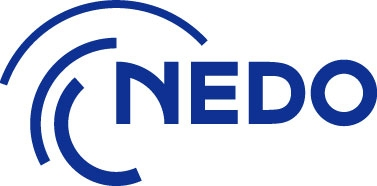
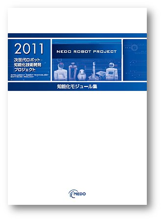

このページでは、NEDO「次世代知能化技術技術開発プロジェクト」（知能化プロジェクト）で開発された様々なミドルウエア、ツールおよびモジュール（=RTコンポーネント）を紹介します。

知能化プロジェクトにおいては、開発支援ツールを含むソフトウエアプラットフォームの開発と、これを基盤としたロボットの知能化に必要な作業・移動・対話をターゲットとして、知能モジュール（＝RTコンポーネント）の開発を行ってきました。
開発されたツールおよびモジュールのうちオープンソースとして公開可能なモジュール群を本ページで公開しています。
また、商用ライセンスのものとに公開されているツールおよびモジュールについても、概要を紹介しています。

#clear

<!-- -開発支援ツール -->
<!-- -作業知能モジュール -->
<!-- -移動知能モジュール -->
<!-- -対話知能モジュール -->
<!-- -商用ライセンスモジュール -->

<!-- #contents -->
<!-- #clear -->

<!-- 

;

;

;
 

;

;

;
-->

## NEDOモジュールカタログ

カタログ形式で一覧できる知能化モジュール集を公開しています。

- **[知能化モジュール集(PDF)](http://www.openrtm.org/openrtm/sites/default/files/4599/nedo_rtc_list.pdf)**

## ビデオ

ここでは、NEDO知能化モジュールに関するビデオの一部を紹介します。

### [Nitta力センサコンポーネント](http://www.openrtm.org/openrtm/ja/project/NEDO_Intelligent_PRJ_ID171)

<iframe width="560" height="315" src="https://www.youtube.com/embed/MsqQW97oox0" frameborder="0" allowfullscreen></iframe>

<!-- nowiki>
[video:http://www.youtube.com/watch?v=MsqQW97oox0
</nowiki-->

### [LRF SICK LMS2xx距離データ取得モジュール](http://www.openrtm.org/openrtm/ja/project/NEDO_Intelligent_PRJ_ID259)

<iframe width="560" height="315" src="https://www.youtube.com/embed/nDulfEl-EWU" frameborder="0" allowfullscreen></iframe>

### [Blackship制御RTC （オープンソース）](http://www.openrtm.org/openrtm/ja/project/NEDO_Intelligent_PRJ_ID054)

<iframe width="560" height="315" src="https://www.youtube.com/embed/uWSck7EWkXI" frameborder="0" allowfullscreen></iframe>

### [MobileRobots社ロボット用制御RTC](http://www.openrtm.org/openrtm/ja/project/NEDO_Intelligent_PRJ_ID363)

<iframe width="560" height="315" src="https://www.youtube.com/embed/zHcfm0baQ3c" frameborder="0" allowfullscreen></iframe>

### [チョコ停事前回避コントロールRTC](http://www.openrtm.org/openrtm/ja/project/NEDO_Intelligent_PRJ_ID327)

<iframe width="560" height="315" src="https://www.youtube.com/embed/0pb3XgxTr_w" frameborder="0" allowfullscreen></iframe>

### [DFITコンポーネント](http://www.openrtm.org/openrtm/ja/project/NEDO_Intelligent_PRJ_ID185)

<iframe width="560" height="315" src="https://www.youtube.com/embed/ZQkWD_LMX7g" frameborder="0" allowfullscreen></iframe>

