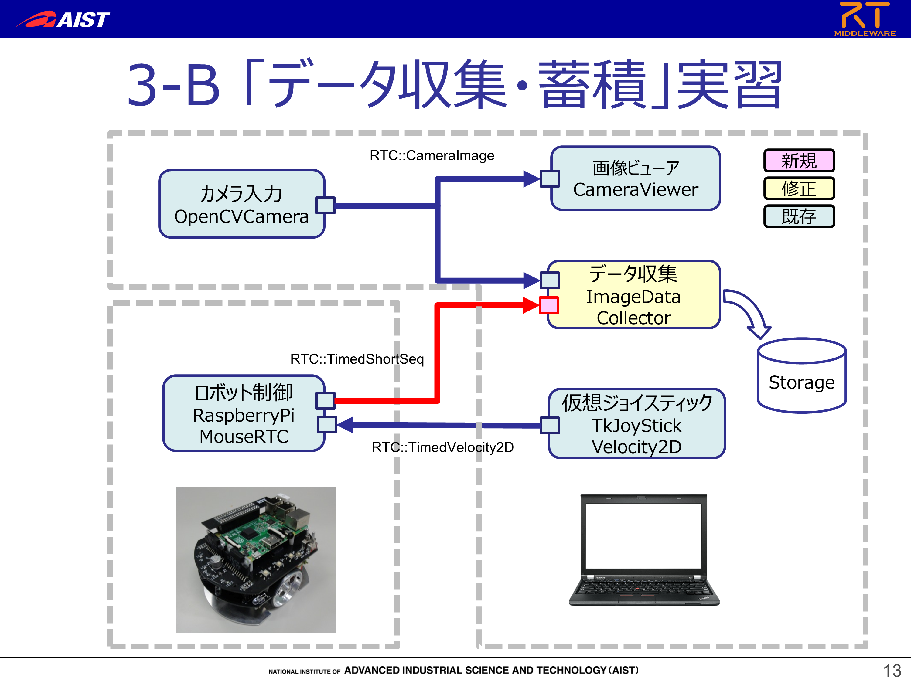
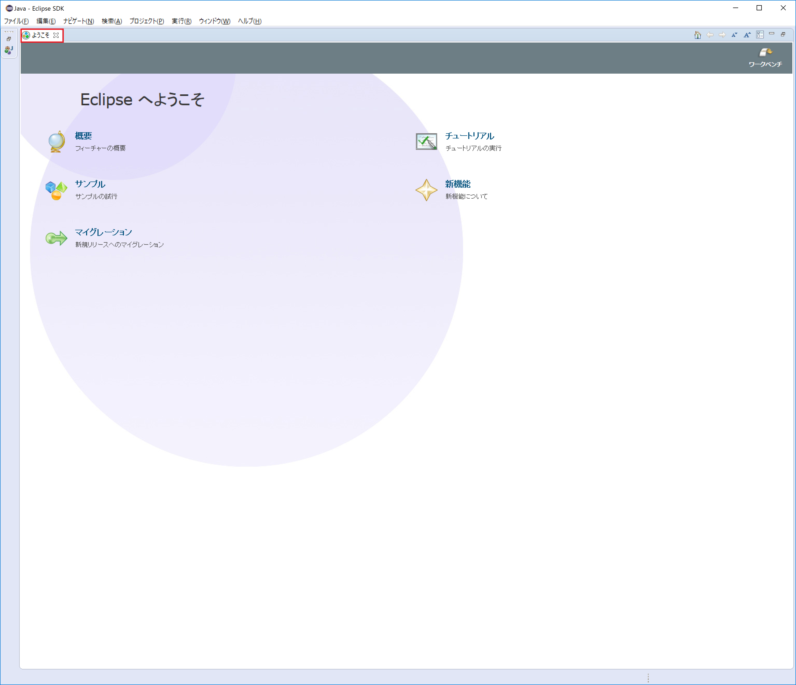
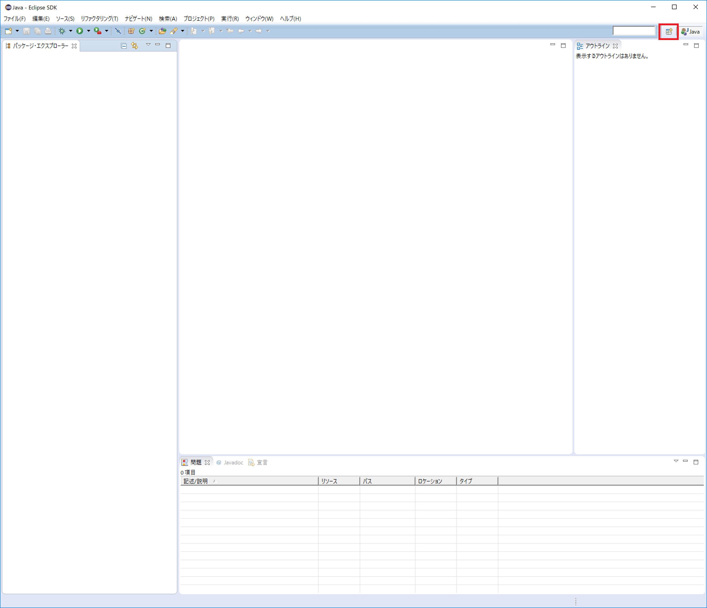
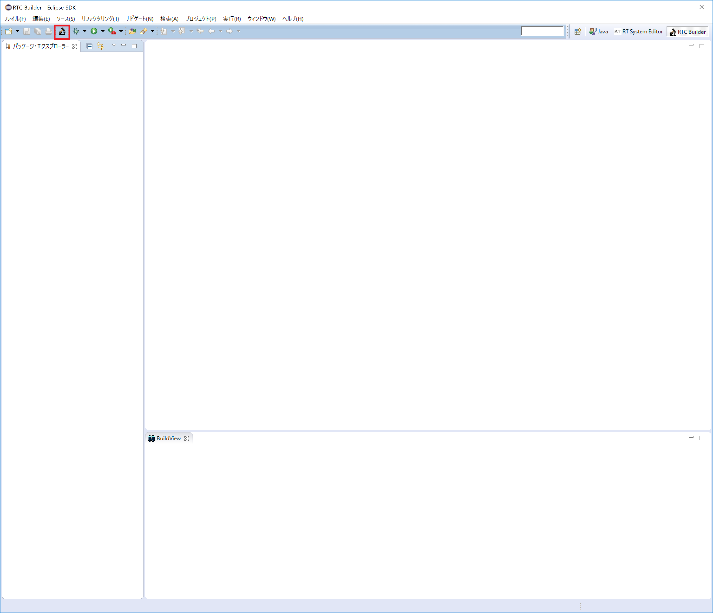
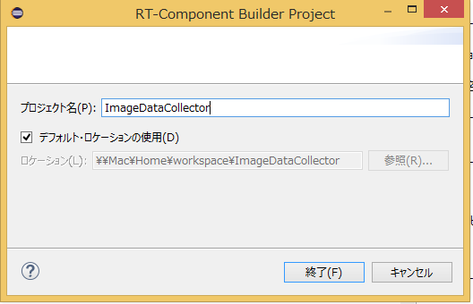
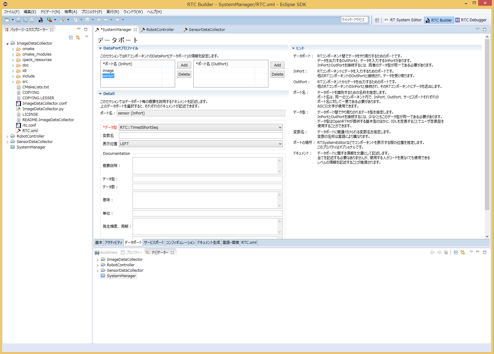
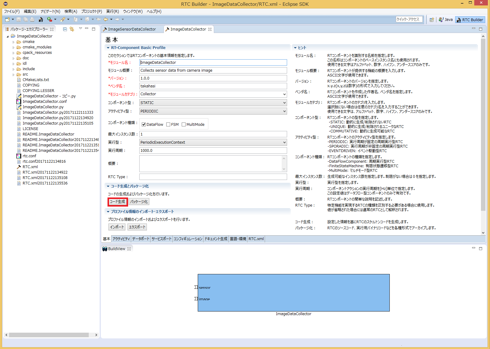
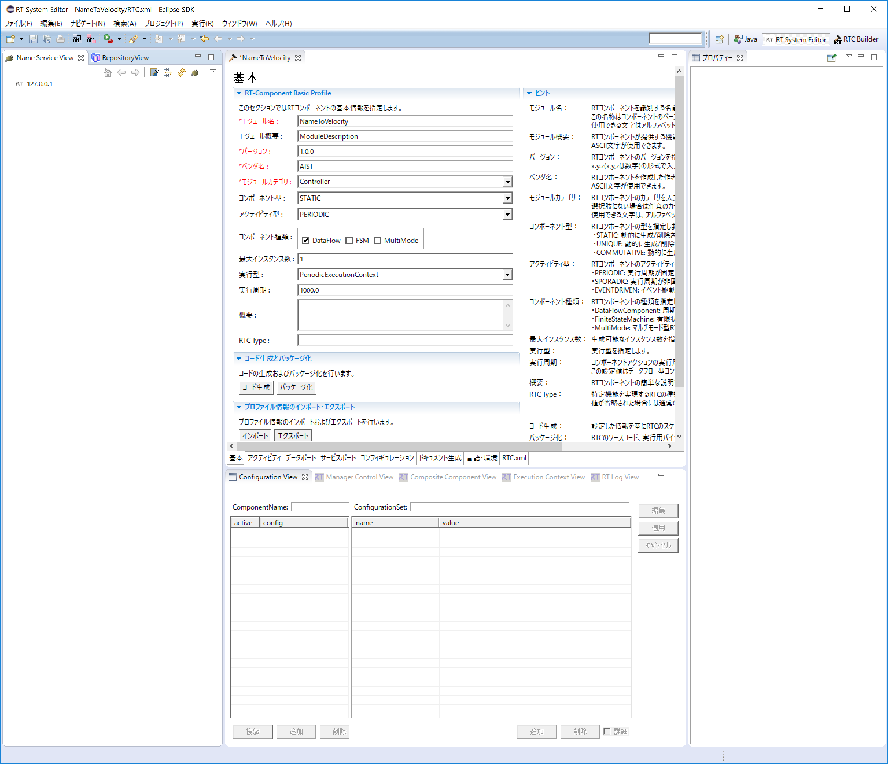
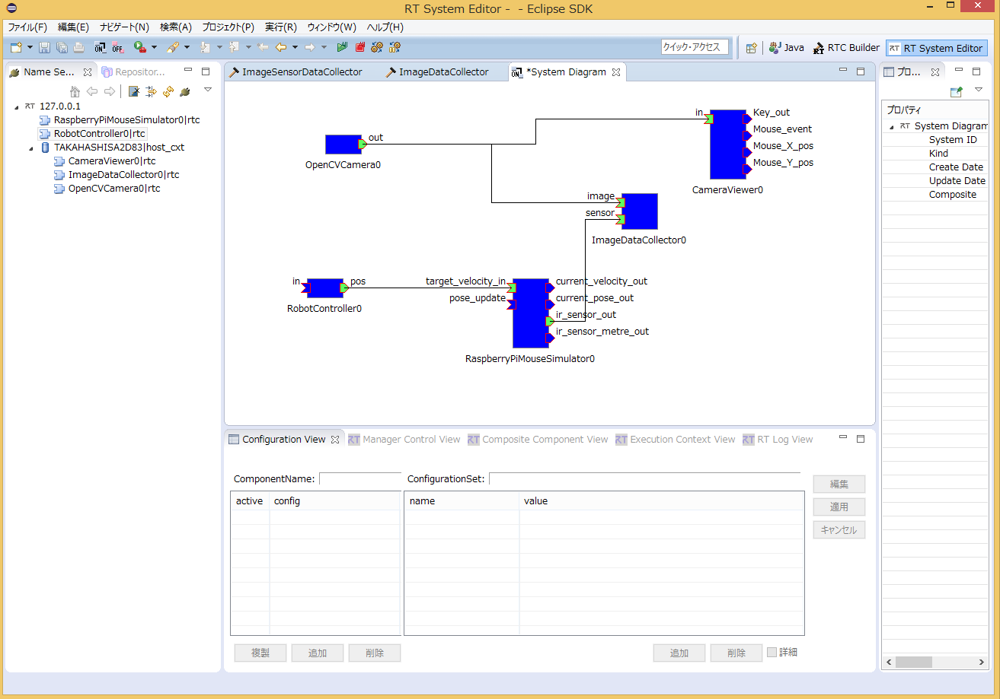
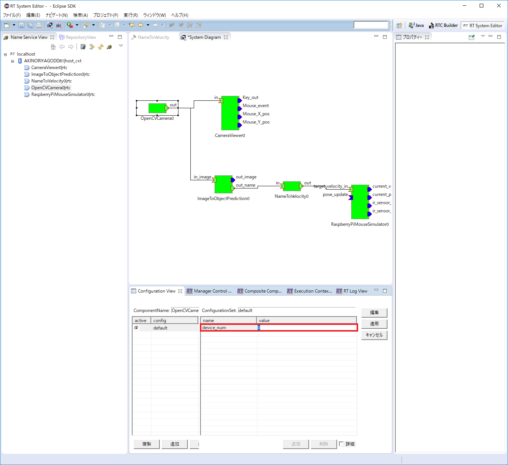

#contents

# 目的
RTM（OpenRTM-aist）を利用し、人工知能技術を応用したロボットシステムを構築します．
<br>
深層学習による画像認識を利用した移動ロボット制御システムを作成することで、実際の研究、開発へのアプリケーション応用について学びます．

## 本チュートリアルで構築するRTシステム
ロボットをジョイスティックで操作し，その際のカメラ入力やセンサ入力値を自動的に収集するシステムを構築します．
<br>
実習時間の都合上，既存の画像収集コンポーネント（ImageDataCollector）を再利用し，ロボットのセンサ入力取得，ファイルへの保存機能を追加します．

<div align="center"><a href="tutorial_jsai_3b_0.png"></a></div>


# ImageDataCollectorコンポーネントの改造
A
## 改造するRTコンポーネント
「ImageDataCollector」というコンポーネントを改造します.
<br>
Webカメラの画像を入力とし、入力された画像を定期的にファイルとして保存するコンポーネントです.

## 作成手順と開発環境
下記URLの「作成手順」「開発環境の確認」を参照ください．
<br>
- [チュートリアル(Raspberry Pi Mouse、Python、Windows、強化月間用)]({{ site.baseurl }}/ja/doc/casestudy/raspberrypi_mouse/raspimouse_tutorial_bootcamp/tutorial_bootcamp_python_windows/)

また，下記のパッケージも事前にインストールしておいてください．

- Python パッケージ
  - OpenCV (画像認識ライブラリ) http://opencv.jp/
    - **pip install opencv-python** でインストールできます
  - 画像保存コンポーネント ImageDataCollector
    - 講習会時には別途USBメモリ等で配布しますが，下記からダウンロードも可能です
    - git clone https://github.com/takahasi/ImageDataCollector.git

## コンポーネントの仕様
ImageDataCollectorは「Webカメラ画像を入力とするインポート」をひとつ持っています.
<br>
ここに「ロボットの近接センサ値を入力とするインポート」をひとつ追加します．


<table class="table-alt">
  <tr>
    <th>**コンポーネント名**</th>
    <th>**ポート名**</th>
    <th>**型名**</th>
    <th>**説明**</th>
  </tr>
  <tr>
    <td>ImageDataCollector</td>
    <td>image</td>
    <td>CameraImage</td>
    <td>Webカメラ画像を入力とするポート</td>
  </tr>
  <tr>
    <td>sensor</td>
    <td>TimedShortSeq</td>
    <td>ロボットの近接センサ値を入力とするポート</td>
  </tr>
</table>


## ImageDataCollectorコンポーネントへのポート追加
ImageDataCollectorコンポーネントに新しいポートを追加する作業を「RTC Builder」を用いて行います.
<br>
まず Eclipse を起動します.
<br>
Windows 8.1の場合は「スタート」>「アプリビュー(右下矢印)」>「OpenRTM-aist 1.1.2」>「OpenRTP」をクリックすると起動できます.
<br>
ワークスペースの場所を決める必要があるので指定してください.

<div align="center"><a href="tutorial_jsai_3_1.png"></a></div>

指定すると、下記の画面が表示されますが、Welcomeページは必要ないので閉じてください.

<div align="center"><a href="tutorial_jsai_3_2.png"></a></div>

「RTC Builder」のパースペクティブを開きます.

<div align="center"><a href="tutorial_jsai_3_3.png"></a></div>

<div align="center"><a href="tutorial_jsai_3_4.png"></a></div>


### 新規プロジェクトの作成
ImageDataCollectorコンポーネントを作成するために、RTC Builderで新規プロジェクトを作成します.
左上の「Open New RTC Builder Editor」アイコンをクリックしてください.

<div align="center"><a href="tutorial_jsai_3_5.png"></a></div>

プロジェクト名を入力するウインドウが開くので、プロジェクト名を入力してください.
<br>
ここでは「ImageDataCollector」としています.

<div align="center"><a href="tutorial_jsai_3b_6.png"></a></div>

指定したプロジェクトが生成され、パッケージエクスプローラ内に表示されます.


### プロファイルの読み込み
RTC Builder には既存のコンポーネントのプロファイルを読み込み，追加，修正できる機能があります．
<br>
「基本」タブにある「プロファイル情報のインポート・エクスポート」の「インポート」ボタンをクリックし，改造元のImageDataCollectorにあるRTC.xmlを選択します．
<br>
下記画面のようにモジュール概要などが読み込まれていれば成功です．

<div align="center"><a href="tutorial_jsai_3b_10.png"></a></div>

### ポートの追加
次に、「データポート」タブを選択し、データポートの情報を入力します.
<br>
追加するポート仕様を元に以下のように入力します.
<br>
なお、変数名や表示位置の設定はオプションのため、そのままで問題ありません.

- InPort Profile:
  - ポート名: sensor
  - データ型: TimedShortSeq

<div align="center"><a href="tutorial_jsai_3b_11.png"></a></div>


最後に、「基本」タブにある [コード生成] ボタンをクリックしてコンポーネントのひな形を作成します.

<div align="center"><a href="tutorial_jsai_3b_12.png"></a></div>

## ソースコードの編集
自動生成された「ImageDataCollector.py」をエディタで開いて編集します.
<br>
RTCBuilderには既存コードとのマージ機能もあるのですが，所望のコード形式にならないことがあるので，今回は手作業でマージします．
<br>
ImageDataCollector.pyは、（指定したワークスペースディレクトリ）¥ImageDataCollectorフォルダの中にあります.

Pythonがインストールされていれば、標準で付属しているIDLEというエディタが使えるため、
WindowsであればImageDataCollector.pyを右クリックして""Edit with IDLE""を選択すれば編集することができます.

<div align="center"><a href="tutorial_jsai_3_13.png"></a></div>

## 変数初期化部分の修正
init関数内に"self._d_sensor"変数初期化部分と必要なパッケージのimport文を追加します.
(ポート名をsensor以外に設定している場合は、self._d_XXXを設定した名前で適宜読み替えてください）

### 変更前
```
    import sys
    import time
    sys.path.append(".")
    
    # Import RTM module
    import RTC
    import OpenRTM_aist
```

```
    def __init__(self, manager):
        OpenRTM_aist.DataFlowComponentBase.__init__(self, manager)
        
        image_arg = [None] * ((len(RTC._d_CameraImage) - 4) / 2)
        self._d_image = RTC.CameraImage(*in_arg)
        """
        """
        self._imageIn = OpenRTM_aist.InPort("image", self._d_image)
        sensor_arg = [None] * ((len(RTC._d_TimedShortSeq) - 4) / 2)
        self._d_sensor = RTC.TimedShortSeq(*sensor_arg)
        """
        """
        self._sensorIn = OpenRTM_aist.InPort("sensor", self._d_sensor)
```


### 変更後
```
    import sys
    import time
    import os
    sys.path.append(".")
    
    # Import RTM module
    import RTC
    import OpenRTM_aist
    
    import cv2
    import numpy as np
    from datetime import datetime as dt
```

```
    def __init__(self, manager):
        OpenRTM_aist.DataFlowComponentBase.__init__(self, manager)
        
        self._d_image = RTC.CameraImage(RTC.Time(0, 0), 0, 0, 0, [], 0, [])
        self._imageIn = OpenRTM_aist.InPort("image", self._d_image)
        
        self._d_sensor = RTC.TimedShortSeq(RTC.Time(0, 0), [])
        self._sensorIn = OpenRTM_aist.InPort("sensor", self._d_sensor)
```


## アクティビティ処理の実装
ImageDataCollectorコンポーネントの仕様に従い、入力されたでーたを保存する処理を記述します.

```
    def onActivated(self, ec_id):
        # 変数の初期化
        self._count = 0
        t = dt.now()
        
        # センサ用出力ディレクトリ作成
        self._image_dir = "image_" + t.strftime('%Y%m%d')
        if not os.path.exists(self._image_dir):
            os.mkdir(self._image_dir)
        
        # センサ用出力ディレクトリ作成
        self._sensor_dir = "sensor_" + t.strftime('%Y%m%d')
        if not os.path.exists(self._sensor_dir):
            os.mkdir(self._sensor_dir)
        
        self._f = open(self._sensor_dir + "/sensor.csv", 'w')
        
        return RTC.RTC_OK
```

```
    def onDeactivated(self, ec_id):
        self._count = 0
        self._f.close()
        
        return RTC.RTC_OK
```

```
    def onExecute(self, ec_id):
        if self._imageIn.isNew():
            # 画像イメージの変換
            data = self._imageIn.read()
            frame = np.frombuffer(data.pixels, dtype=np.uint8)
            frame = frame.reshape(data.height, data.width, 3)
            
            # 画像イメージの保存
            cv2.imwrite(self._image_dir + "/" + str(self._count) + ".png", frame)
            self._count += 1
            
        if self._sensorIn.isNew():
            # センサデータの保存
            data = self._sensorIn.read()
            self._f.write(",".join(map(str, data.data)) + "\n")
            
        return RTC.RTC_OK
```


# ImageDataCollector改造コンポーネントの動作確認
まず、シミュレータ上で動作確認を行います.

## シミュレーター上の Raspberry Pi マウスでの確認
下記URLの「シミュレータ」を参照ください.
<br>
- [チュートリアル(Raspberry Pi Mouse、Python、Windows、強化月間用)]({{ site.baseurl }}/ja/doc/casestudy/raspberrypi_mouse/raspimouse_tutorial_bootcamp/tutorial_bootcamp_python_windows/)

### NameServiceの起動
コンポーネントの参照を登録するためのネームサービスを起動します。
<br>
「スタート」>「アプリビュー(右下矢印)」>「OpenRTM-aist 1.1.2」の順に辿り、「Start Naming Service」をクリックしてください.
<br>
※ 「Start Naming Service」をクリックしても omniNames が起動されない場合は、フルコンピュータ名が14文字以内に設定されているかを確認してください.

### RT System Editorの起動
コンポーネントをGUIで操作するために「RT System Editor」を起動します.

<div align="center"><a href="tutorial_jsai_3_sim0.png"></a></div>

<div align="center"><a href="tutorial_jsai_3_sim0_1.png"></a></div>

起動するとNameServerView に先ほど起動したネームサーバーが表示されます.

<div align="center"><a href="tutorial_jsai_3_sim0_2.png"></a></div>

※もし、NameServerView にネームサーバーが表示されない時は、手動で localhost を追加します.
<br>
画像の [ネームサーバの追加] をクリックしダイアログを表示します.
<br>
localhost と入力し、[OK] をクリックして追加できます.

<div align="center"><a href="tutorial_jsai_3_sim1.png"></a></div>

### コンポーネントの起動
下記のコンポーネントを起動します．
<br>
正しく起動が完了した場合，NameServerView上に各コンポーネントが表示され、Drag&Dropすれば「System Diagram」上で他のコンポーネントと接続できるようになります.

#### ImageDataCollector.py
作成したImageDataCollector.pyファイルをダブルクリックもしくはコマンドプロンプトからpython ImageDataCollector.pyとして起動して下さい．

#### OpenCVCameraComp.exe
OpenRTM-aistインストール時に同時にインストールされています．
<br>
Windowsの検索（Windowsアイコン押下時のプログラムとファイルの検索など）を用い，OpenCVCameraComp.exeを起動して下さい．

#### CameraViewerComp.exe
OpenRTM-aistインストール時に同時にインストールされています．
<br>
Windowsの検索（Windowsアイコン押下時のプログラムとファイルの検索など）を用い，CameraViewerComp.exeを起動して下さい．

#### RaspberryPiMouseSimulatorComp.exe
USBメモリで配布されたEXEフォルダにあるRaspberryPiMouseSimulatorComp.exeをダブルクリックして起動して下さい．

#### RobotController.py
第２部で作成したRobotController.pyをダブルクリックして起動して下さい．


<div align="center"><a href="tutorial_jsai_3_sim2.png"></a></div>

### コンポーネントの接続
「System Diagram」上で下図のようにポートを接続してください.

<div align="center"><a href="tutorial_jsai_3b_sim3.png"></a></div>

### コンポーネントのActivate
「RT System Editor」の上部にある[All Activate] というアイコンをクリックし、全てのコンポーネントをアクティブ化します.
<br>
※下図のように、「System Diagram」上で右クリックすることでもアクティブ化できます.

<div align="center"><a href="tutorial_jsai_3_sim4.png"></a></div>

正常にアクティベートされた場合には、すべてのコンポーネントが黄緑色で表示され,動作を確認することができます.
<br>
RobotControllerによって、シミュレータ上のマウスの操作ができるか確認してください.
<br>
また，ImageDataCollectorを起動したフォルダに画像やセンサ情報が自動で蓄積されていることを確認してください．

<div align="center"><a href="tutorial_jsai_3_sim5.png"></a></div>

Activate後にImageDataCollectorのソースコードを変更したい場合には、「All Deactivate」を実施した後、ImageDataCollectorを「Exit」してソースコードを変更してください.
<br>
再度、ImageDataCollectorコンポーネントを起動して接続した後、「All Activate」すれば変更した動作が確認できます.


### カメラデバイスの切り替え
内臓カメラのあるPCでWebカメラをお使いの場合、内臓カメラの映像が表示されるかもしれません.
<br>
Webカメラなどに切り替えたい場合には、「Ssytem Diagram」上でOpenCVCameraCompをクリックして下図の「device_num」の値を「1」などに変更してください.
<br>
動作中に変更可能です.

<div align="center"><a href="tutorial_jsai_3_sim6.png"></a></div>

### RT Systemの保存と復元
保存：RT Systemを保存する場合は System Diagram 上で右クリックして [Save As...] を選択してください.
<br>
復元：復元する場合は [Open and Restore] を選択して、先ほど保存したファイルを選択します.

## 実機での動作確認
電源の入れ方や注意点の記載が下記にあるので参照ください.
<br>
[チュートリアル(Raspberry Pi Mouse、Python、Windows、強化月間用)]({{ site.baseurl }}/ja/doc/casestudy/raspberrypi_mouse/raspimouse_tutorial_bootcamp/tutorial_bootcamp_python_windows/)
の「実機での動作確認」以降を参照ください.

## コンポーネントの接続例
シミュレータの時と同様にコンポーネントを接続した後、Activateしてください.


