#contents

# 目的
RTM（OpenRTM-aist）を利用し、人工知能技術を応用したロボットシステムを構築します．
<br>
深層学習による画像認識を利用した移動ロボット制御システムを作成することで、実際の研究、開発へのアプリケーション応用について学びます．

## 本チュートリアルで構築するRTシステム
カメラ入力により物体を認識し，認識した物体に応じたロボット速度制御を行うシステムを構築します．
<br>
実習時間の都合上，学習済みのモデルから推論するRTコンポーネント（ImageToObjectPrediction）を再利用します．
<br>
物体認識にはCNNでImageNetを事前に学習したモデルを使います（chainer + GooLeNet で実装してあります）．

<div align="center"><a href="tutorial_jsai_3_0.png">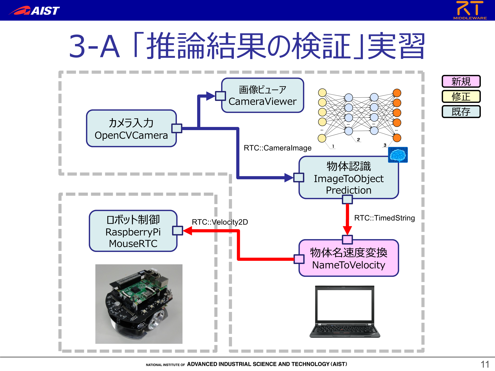</a></div>

# NameToVelocityコンポーネントの作成

## 作成するRTコンポーネント
「NameToVelocity」というコンポーネントを作成します.
<br>
Webカメラで検知した物体の名前を入力とし、入力された名前によって速度を変更することで、ロボットを操作するコンポーネントです.

## 作成手順と開発環境
下記URLの「作成手順」「開発環境の確認」を参照ください
<br>
[チュートリアル(RTコンポーネントの作成入門、Raspberry Pi Mouse、Python、Windows)]({{ site.baseurl }}/ja/doc/casestudy/raspberrypi_mouse/raspimouse_tutorial_bootcamp/tutorial_bootcamp_python_windows)


- OS: Windows 8.1(7、10も可)
- [OpenRTM-aist: 1.1.2-RELEASE]({{ site.baseurl }}/ja/download/openrtm-aist-cpp/openrtm-aist-cpp_1_1_2_release)
- [CMake](https://cmake.org/files/v3.5/cmake-3.5.2-win32-x86.msi)：3.5以上推奨
- [Python 2.7](https://www.python.org/ftp/python/2.7.13/python-2.7.13.msi)
- [Doxygen](http://ftp.stack.nl/pub/users/dimitri/doxygen-1.8.11-setup.exe)
- Python用のエディタ
  - IDLE(Pythonに標準で付属)
  - [PythonWin](https://wiki.python.org/moin/PythonWin)
  - [PyScripter](https://sourceforge.net/projects/pyscripter/)
  - PyDev
- Python パッケージ
  - Chainer  (Deep Learning フレームワーク) https://chainer.org/
    - **pip install chainer** でインストールできます
  - OpenCV (画像認識ライブラリ) http://opencv.jp/
    - **pip install opencv-python** でインストールできます
  - Chainer を利用した物体認識コンポーネント ImageToObjectPrediction
    - 講習会時には別途USBメモリ等で配布しますが，下記からダウンロードも可能です
    - git clone https://github.com/takahasi/ImageToObjectPrediction.git

## コンポーネントの仕様
NameToVelocityは「Webカメラで検知した物体の名前を入力とするインポート」と「ロボットの移動速度を出力するアウトポート」をそれぞれひとつずつ持ちます.

<table class="table-alt">
  <tr>
    <th>**コンポーネント名**</th>
    <th>**ポート名**</th>
    <th>**型名**</th>
    <th>**説明**</th>
  </tr>
  <tr>
    <td>NameToVelocity</td>
    <td>in</td>
    <td>TimedString</td>
    <td>Webカメラで検知した物体の名前を入力とするポート</td>
  </tr>
  <tr>
    <td>out</td>
    <td>TimedVelocity2D</td>
    <td>ロボットの移動速度を出力とするポート</td>
  </tr>
</table>

### TimedVelocity2D型について
「TimedVelocity2Dについて」を参照ください
<br>
[チュートリアル(RTコンポーネントの作成入門、Raspberry Pi Mouse、Python、Windows)]({{ site.baseurl }}/ja/doc/casestudy/raspberrypi_mouse/raspimouse_tutorial_bootcamp/tutorial_bootcamp_python_windows)

## NameToVelocityコンポーネントのひな形の作成
NameToVelocityコンポーネントのひな形の作成は、「RTC Builder」を用いて行います.
<br>
まずは Eclipse を起動します.
<br>
Windows 8.1の場合は「スタート」>「アプリビュー(右下矢印)」>「OpenRTM-aist 1.1.2」>「OpenRTP」をクリックすると起動できます.
<br>
ワークスペースの場所を決める必要があるので指定してください.

<div align="center"><a href="tutorial_jsai_3_1.png">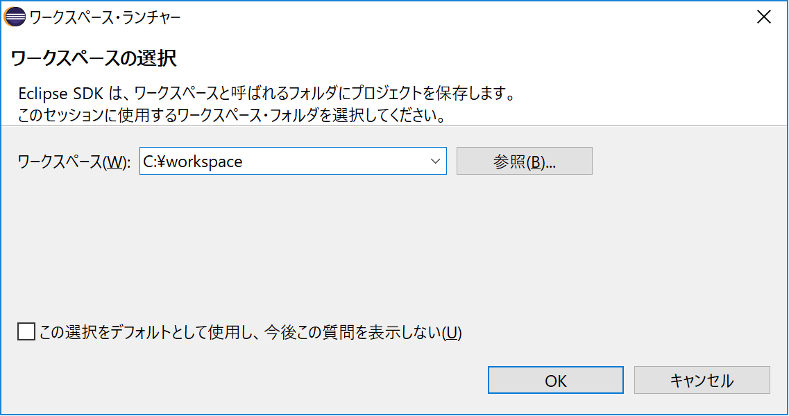</a></div>

指定すると、下記の画面が表示されますが、Welcomeページは必要ないので閉じてください.

<div align="center"><a href="tutorial_jsai_3_2.png"></a></div>

「RTC Builder」のパースペクティブを開きます.

<div align="center"><a href="tutorial_jsai_3_3.png"></a></div>
<div align="center"><a href="tutorial_jsai_3_4.png">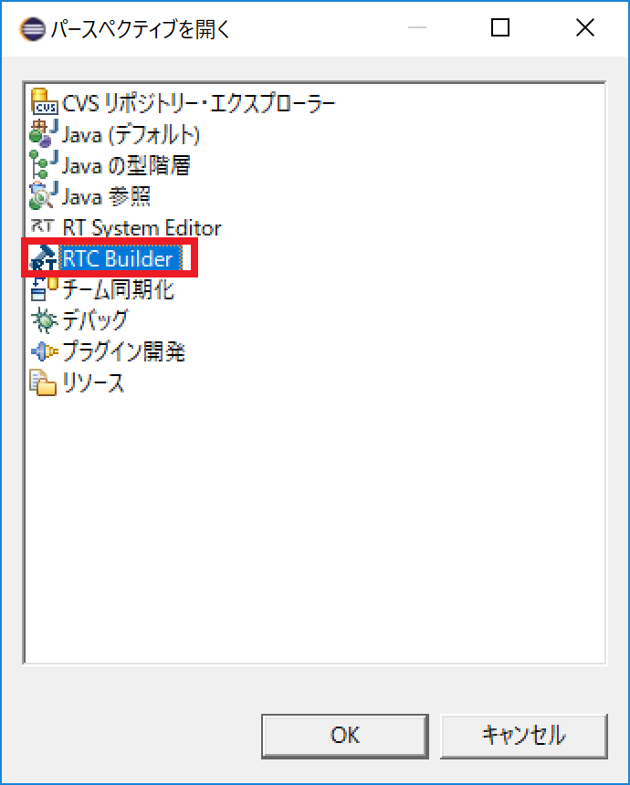</a></div>


### 新規プロジェクトの作成
NameToVelocityコンポーネントを作成するために、RTC Builderで新規プロジェクトを作成します.
左上の「Open New RTC Builder Editor」アイコンをクリックしてください.

<div align="center"><a href="tutorial_jsai_3_5.png"></a></div>

プロジェクト名を入力するウインドウが開くので、プロジェクト名を入力してください.
<br>
サンプルとして、ここでは「NameToVelocity」としています.

<div align="center"><a href="tutorial_jsai_3_6.png">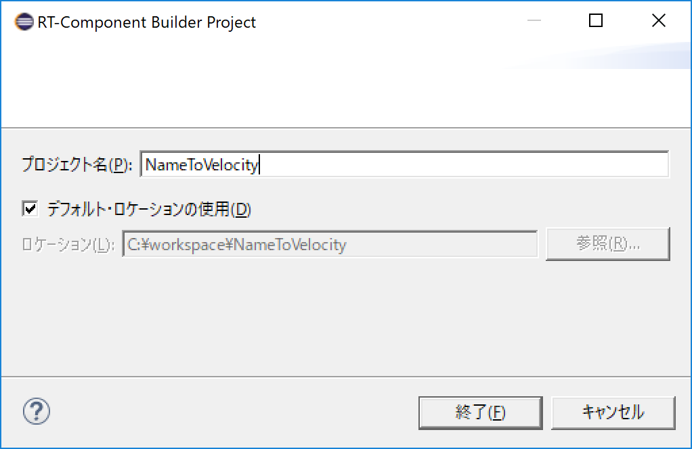</a></div>

指定したプロジェクトが生成され、パッケージエクスプローラ内に表示されます.
<br>
生成したプロジェクト内には、デフォルトで設定されたRTCプロファイルのXML(RTC.xml)が自動で生成されます.

<div align="center"><a href="tutorial_jsai_3_7.png">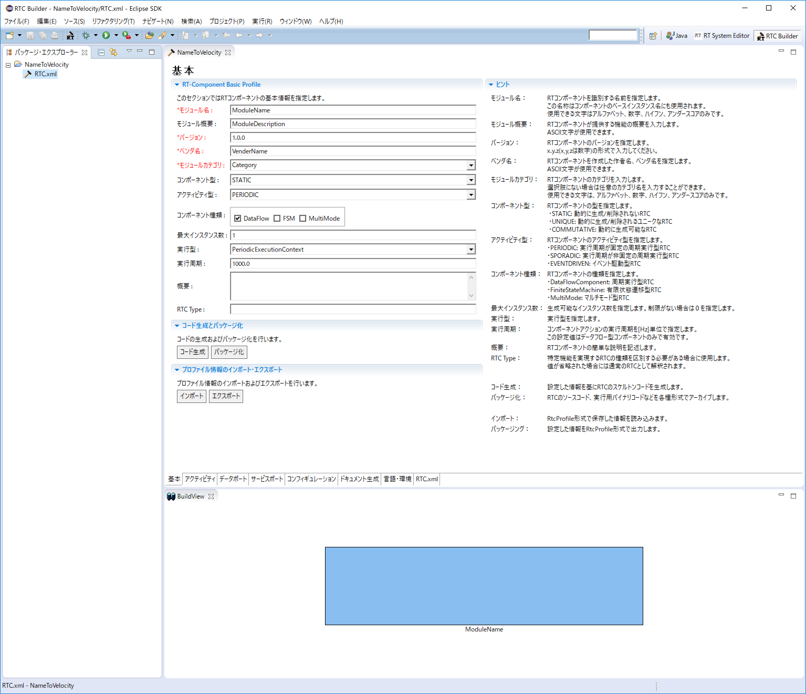</a></div>

### RTCプロファイルエディタが起動されない場合
RTC.xmlが生成された時点で、RTC Builderのエディタが開らくはずですが、開かれていない場合は、パッケージエクスプローラのRTC.xmlをダブルクリックしてください.

### プロファイル情報入力とコード生成
まず、一番左にある「基本」タブを選択し、基本情報を入力します.
<br>
先ほど決めた「NameToVelocity」コンポーネントの仕様(名前)の他に、概要やバージョン等を入力してください.
<br>
ラベルが赤字の項目は必須項目なので何か入力してください、その他はデフォルトで構いません.

<div align="center"><a href="tutorial_jsai_3_8.png"></a></div>

次に、「アクティビティ」タブを選択し、使用するアクションコールバックを指定します.

NameToVelocityコンポーネントでは、onActivated()、onDeactivated()、onExecute() コールバックを使用することとします.
<br>
下図のように①の onAtivated をクリック後に②のラジオボタンにて [ON] にチェックを入れて有効化します.
<br>
選択されている関数名は赤字になり、有効化すると背景色が青色に変化します.
<br>
onDeactivated、onExecute についても同様の手順を実施して有効化してください.

各コールバック関数の概要やいつ呼ばれるかを知りたい方は下記を参照願います.
<br>
http://openrtm.org/openrtm/ja/content/rtc開発の流れ

<div align="center"><a href="tutorial_jsai_3_9.png">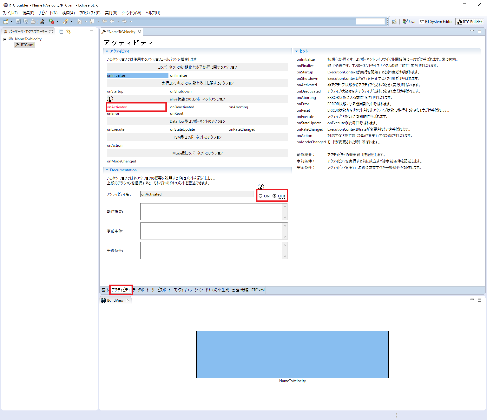</a></div>

次に、「データポート」タブを選択し、データポートの情報を入力します.
<br>
先ほど決めた仕様を元に以下のように入力します.
<br>
なお、変数名や表示位置の設定はオプションのため、そのままで問題ありません.

- InPort Profile:
  - ポート名: in
  - データ型: TimedString

- OutPort Profile:
  - ポート名: out
  - データ型: TimedVelocity2D

<div align="center"><a href="tutorial_jsai_3_10.png">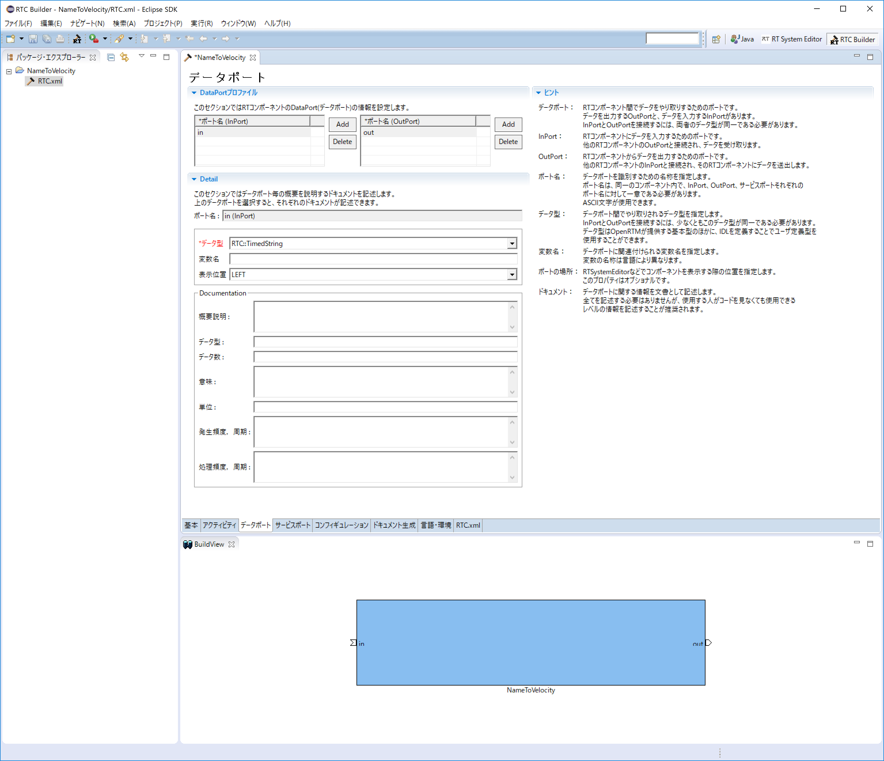</a></div>

次に、「言語・環境」タブを選択し、プログラミング言語を選択します. ここでは、Python(言語)を選択します.
<br>
なお、プログラミング言語の選択はデフォルトが設定されておらず、指定しない場合にはコード生成時にエラーになりますので、必ず言語の指定を行ってください.

<div align="center"><a href="tutorial_jsai_3_11.png">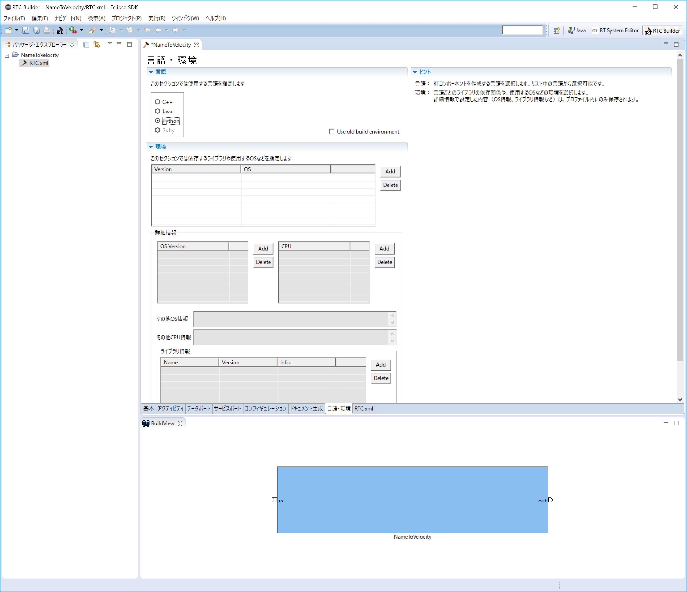</a></div>

最後に、「基本」タブにある [コード生成] ボタンをクリックしてコンポーネントのひな形を作成します.

<div align="center"><a href="tutorial_jsai_3_12.png"></a></div>


## ソースコードの編集
自動生成された「NameToVelocity.py」をエディタで開いて編集します.
<br>
NameToVelocity.pyは、（指定したワークスペースディレクトリ）¥NameToVelocityフォルダの中にあります.

Pythonがインストールされていれば、標準で付属しているIDLEというエディタが使えるため、
WindowsであればNameToVelocity.pyを右クリックして""Edit with IDLE""を選択すれば編集することができます.

<div align="center"><a href="tutorial_jsai_3_13.png">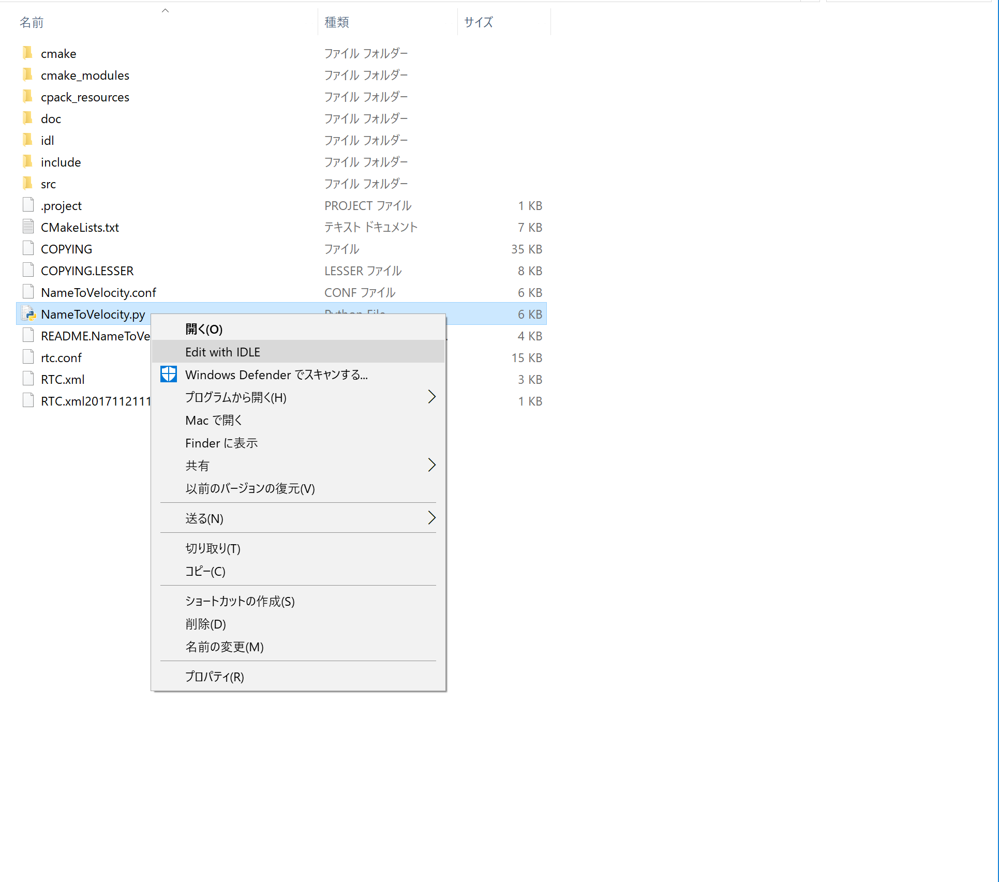</a></div>


## 変数初期化部分の修正
OpenRTM-aist 1.1.2のRTC Builderを使用している場合は、変数初期化部分を修正する必要があります.
(OpenRTM-aist 1.2.0では修正される予定です)
<br>
init関数内の"self._d_in"と"self._d_out"変数初期化部分を修正します.
(ポート名をin,out以外に設定している場合は、self._d_XXXを設定した名前で適宜読み替えてください）


### 変更前
	def <u>init</u>(self, manager):
		OpenRTM_aist.DataFlowComponentBase.<u>init</u>(self, manager)
		
		in_arg = [None] * ((len(RTC._d_TimedString) - 4) / 2)
		self._d_in = RTC.TimedString(*in_arg)
		"""
		"""
		self._inIn = OpenRTM_aist.InPort("in", self._d_in)
		out_arg = [None] * ((len(RTC._d_TimedVelocity2D) - 4) / 2)
		self._d_out = RTC.TimedVelocity2D(*out_arg)
		"""
		"""
		self._outOut = OpenRTM_aist.OutPort("out", self._d_out)

### 変更後
	def <u>init</u>(self, manager):
		OpenRTM_aist.DataFlowComponentBase.<u>init</u>(self, manager)
		
		#in_arg = [None] * ((len(RTC._d_TimedString) - 4) / 2)
		#self._d_in = RTC.TimedString(*in_arg)
		#以下の行を追加
		self._d_in = RTC.TimedString(RTC.Time(0,0), "")
		"""
		"""
		self._inIn = OpenRTM_aist.InPort("in", self._d_in)
		
		#out_arg = [None] * ((len(RTC._d_TimedVelocity2D) - 4) / 2)
		#self._d_out = RTC.TimedVelocity2D(*out_arg)
		#以下の行を追加
		self._d_out = RTC.TimedVelocity2D(RTC.Time(0,0), RTC.Velocity2D(0.0, 0.0, 0.0))
		"""
		"""
		self._outOut = OpenRTM_aist.OutPort("out", self._d_out)

## アクティビティ処理の実装
NameToVelocityコンポーネントの仕様に従い、入力された文字列によって速度を変換する処理を記述します.

	def onActivated(self, ec_id):
```
    	#ロボットへの出力を初期化しておく
```
		self._d_out.data.vy = 0.0
		self._d_out.data.vx = 0.0
		self._d_out.data.va = 0.0
		self._outOut.write()
		
		return RTC.RTC_OK

	def onDeactivated(self, ec_id):
	    #ロボットを停止する
		self._d_out.data.vy = 0.0
		self._d_out.data.vx = 0.0
		self._d_out.data.va = 0.0
		self._outOut.write()
		
		return RTC.RTC_OK

	def onExecute(self, ec_id):
		# 入力データが存在するか確認
		if self._inIn.isNew():
			# 入力データが存在する場合には、データを別変数に格納
			data = self._inIn.read()
			
			# 入力データの文字列に応じてロボットを操作する
			if data.data == "bow tie":
				self._d_out.data.vx = 0.5
			
			elif data.data == "hook":
				self._d_out.data.vx = -0.5
			
			elif data.data == "pinwheel":
				self._d_out.data.va = 0.3
			
			elif data.data == "envelope":
				self._d_out.data.va = -0.3
				
			else:
				self._d_out.data.vx = 0
				self._d_out.data.vy = 0
				self._d_out.data.va = 0
				
			self._outOut.write()
		
		return RTC.RTC_OK

# NameToVelocityコンポーネントの動作確認
まず、シミュレータ上で動作確認を行います.

## シミュレーター上の Raspberry Pi マウスでの確認
下記URLの「シミュレータ」を参照ください.
<br>
[チュートリアル(RTコンポーネントの作成入門、Raspberry Pi Mouse、Python、Windows)]({{ site.baseurl }}/ja/doc/casestudy/raspberrypi_mouse/raspimouse_tutorial_bootcamp/tutorial_bootcamp_python_windows)

### NameServiceの起動
コンポーネントの参照を登録するためのネームサービスを起動します。
<br>
「スタート」>「アプリビュー(右下矢印)」>「OpenRTM-aist 1.1.2」の順に辿り、「Start Naming Service」をクリックしてください.
<br>
※ 「Start Naming Service」をクリックしても omniNames が起動されない場合は、フルコンピュータ名が14文字以内に設定されているかを確認してください.

### RT System Editorの起動
コンポーネントをGUIで操作するために「RT System Editor」を起動します.

<div align="center"><a href="tutorial_jsai_3_sim0.png">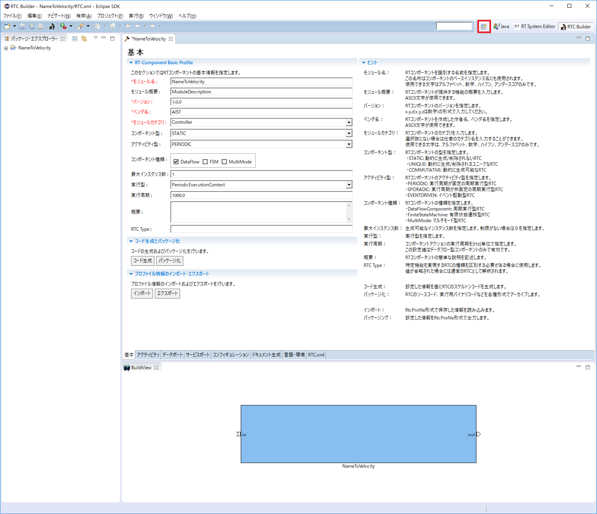</a></div>

<div align="center"><a href="tutorial_jsai_3_sim0_1.png">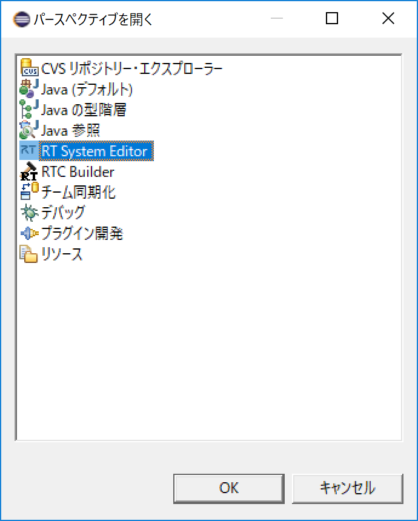</a></div>

起動するとNameServerView に先ほど起動したネームサーバーが表示されます.

<div align="center"><a href="tutorial_jsai_3_sim0_2.png"></a></div>

※もし、NameServerView にネームサーバーが表示されない時は、手動で localhost を追加します.
<br>
画像の [ネームサーバの追加] をクリックしダイアログを表示します.
<br>
localhost と入力し、[OK] をクリックして追加できます.

<div align="center"><a href="tutorial_jsai_3_sim1.png">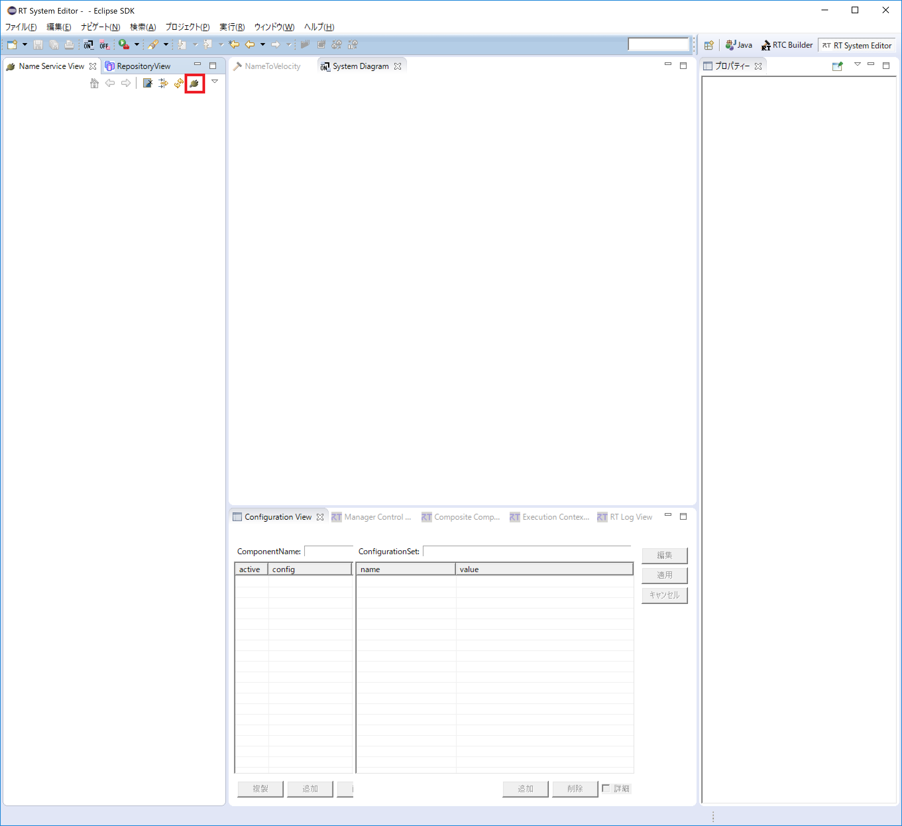</a></div>

### NameToVelocityコンポーネントの起動
NameToVelocityコンポーネントを起動します.
<br>
作成したNameToVelocity.ファイルをダブルクリックしてください.

NameServerView上にNameToVelocityコンポーネントが表示され、Drag&Dropすれば「System Diagram」上で他のコンポーネントと接続できるようになります.

<div align="center"><a href="tutorial_jsai_3_sim2.png">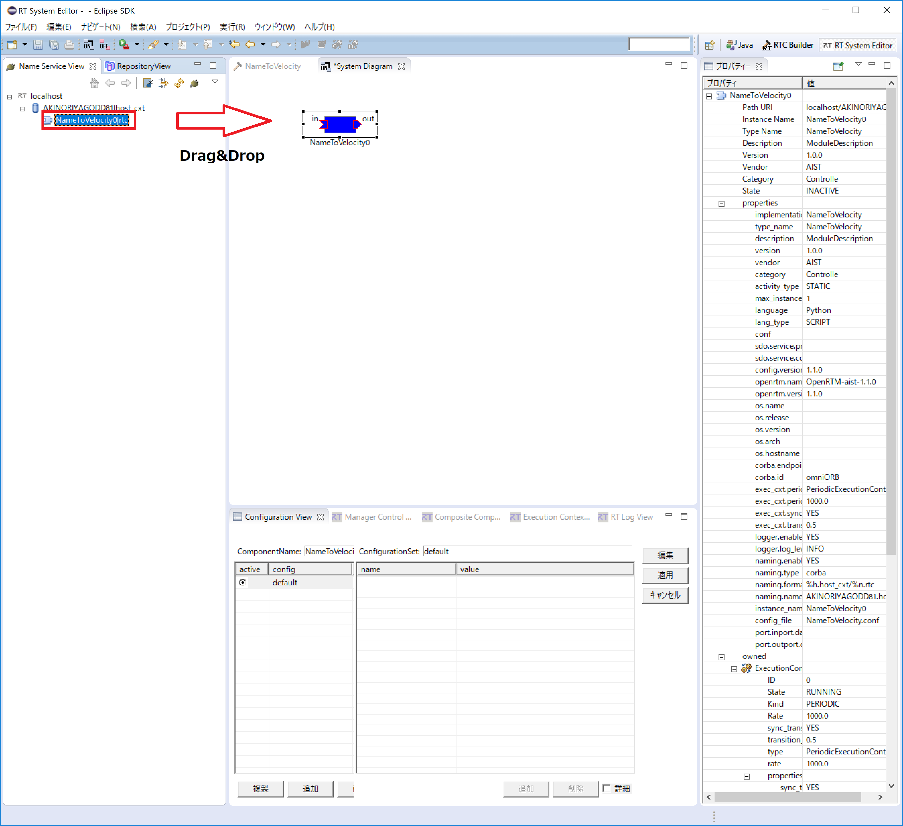</a></div>

### シミュレータなど他のコンポーネントの起動と接続
ImageToObjectPrediction.py, OpenCVCameraComp.exe, CameraViewerComp.exeとRaspberryPiMouseSimulatorComp.exeも同様に起動して「System Diagram」上で接続してください.

<div align="center"><a href="tutorial_jsai_3_sim3.png">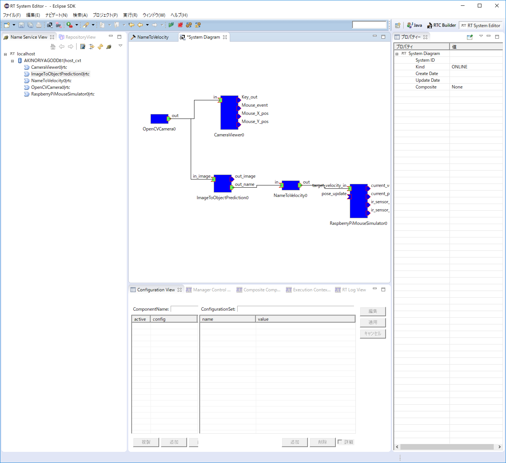</a></div>

### コンポーネントのActivate
「RT System Editor」の上部にある[All Activate] というアイコンをクリックし、全てのコンポーネントをアクティブ化します.
<br>
※下図のように、「System Diagram」上で右クリックすることでもアクティブ化できます.

<div align="center"><a href="tutorial_jsai_3_sim4.png">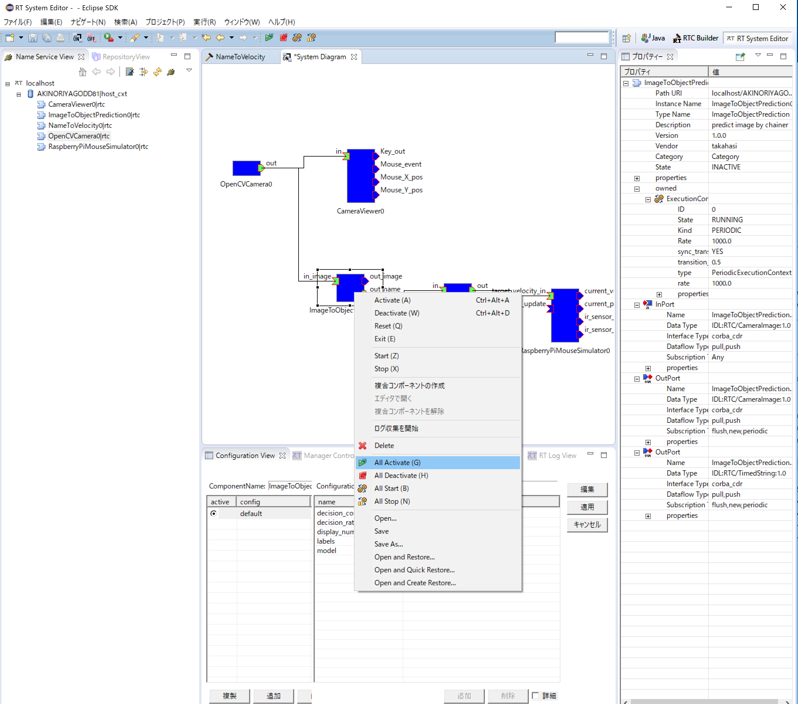</a></div>

正常にアクティベートされた場合には、すべてのコンポーネントが黄緑色で表示され,動作を確認することができます.
<br>
カメラで検知した物体によって、シミュレータ上のマウスの操作ができるか確認してください.
<br>
なお、ImageToObjectPredictionのコンソールで、どのような文字列がNameToVelocityの入力となっているか確認できます.

<div align="center"><a href="tutorial_jsai_3_sim5.png">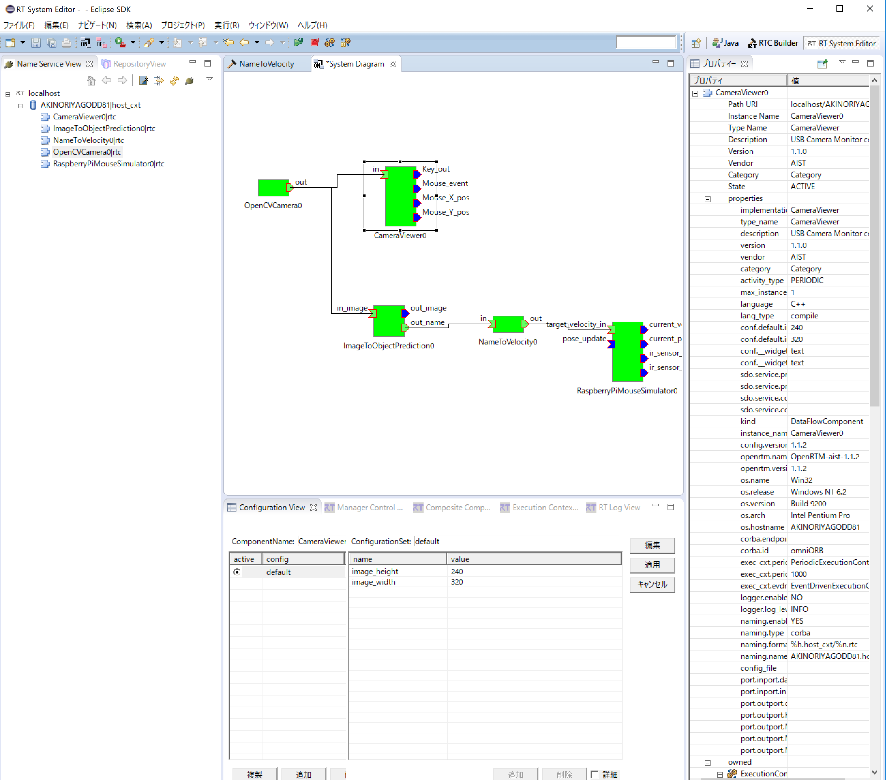</a></div>

Activate後にNameToVelocityのソースコードを変更したい場合には、「All Deactivate」を実施した後、NameToVelocityを「Exit」してソースコードを変更してください.
<br>
再度、NameToVelocityコンポーネントを起動して接続した後、「All Activate」すれば変更した動作が確認できます.


### カメラデバイスの切り替え
内臓カメラのあるPCでWebカメラをお使いの場合、内臓カメラの映像が表示されるかもしれません.
<br>
Webカメラなどに切り替えたい場合には、「Ssytem Diagram」上でOpenCVCameraCompをクリックして下図の「device_num」の値を「1」などに変更してください.
<br>
動作中に変更可能です.

<div align="center"><a href="tutorial_jsai_3_sim6.png"></a></div>

### RT Systemの保存と復元
保存：RT Systemを保存する場合は System Diagram 上で右クリックして [Save As...] を選択してください.
<br>
復元：復元する場合は [Open and Restore] を選択して、先ほど保存したファイルを選択します.

## 実機での動作確認
電源の入れ方や注意点の記載が下記にあるので参照ください.
<br>
[チュートリアル(RTコンポーネントの作成入門、Raspberry Pi Mouse、Python、Windows)]({{ site.baseurl }}/ja/doc/casestudy/raspberrypi_mouse/raspimouse_tutorial_bootcamp/tutorial_bootcamp_python_windows)
の「実機での動作確認」以降を参照ください.

## コンポーネントの接続例
シミュレータの時と同様にコンポーネントを接続した後、Activateしてください.

<div align="center"><a href="tutorial_jsai_3_15.png">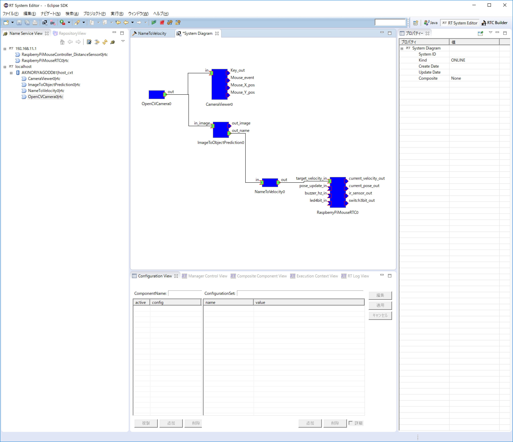</a></div>

